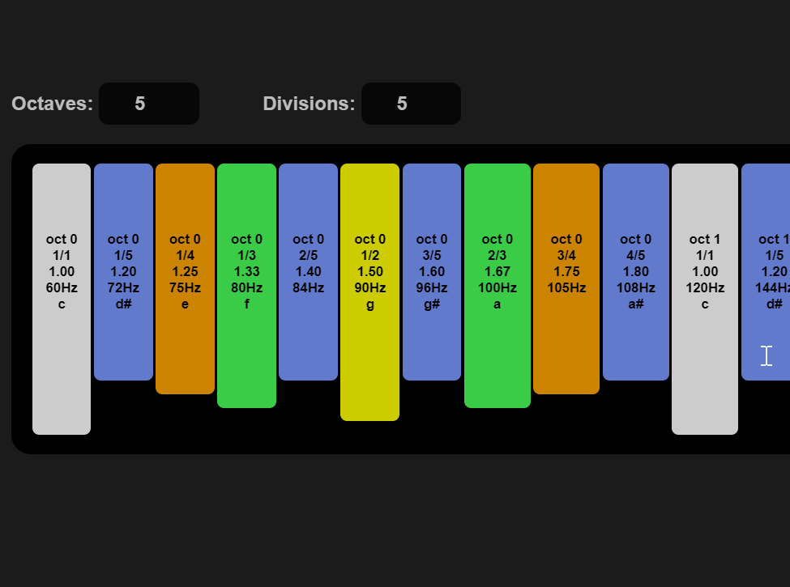

# kedboard

A web based musical keyboard toy that uses keys which are mathematically aligned to perfect ratios of frequencies rather than the standard western 12-tone equal temperament. 

I created this because pianos, notes, keys, and music theory are nonsensical gibberish based on arbitrary decisions made hundreds of years ago and only stuck around because of cultural momentum.

